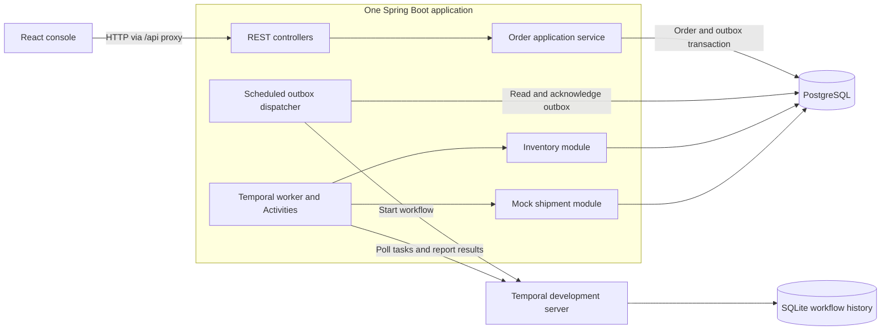

# Temporal Logistics Fulfillment

A Java 21 and Spring Boot order fulfillment application with a React operations console. PostgreSQL stores business records; Temporal coordinates inventory reservation, mock shipment creation, retries, and compensation.

The central problem is a partial failure: a shipment may be committed even when the caller never receives its response. This project demonstrates how retries return the original result and how exhausted retries cancel the committed shipment and restore stock without applying either operation twice.

**Project scope:** a working portfolio application with a simulated carrier. Orders, inventory, and shipments are modules in one backend process and database. Docker and AWS deployment configuration are included; an actual AWS deployment and remote GitHub Actions run have not yet been verified. See [role alignment and evidence](docs/role-alignment.md).

## What you can demonstrate

- Submit a validated REST request and return `202 Accepted` after saving the order and workflow-start outbox entry in one transaction.
- Start asynchronous fulfillment through a scheduled outbox dispatcher and a stable Temporal workflow ID.
- Reserve and release stock idempotently, reject conflicting requests, and prevent negative inventory.
- Create one mock shipment per order, retry temporary failures, and compensate permanent or ambiguous failures.
- Inspect persisted orders, actual Temporal execution state and Activity attempts, inventory, and shipments in an English React console.
- Replay recorded pre-shipment workflow histories to check compatibility after extending the workflow.
- Build container images and use the included CI checks and optional AWS demo release pipeline.

## Architecture



The backend polls Temporal; Temporal does not call a public HTTP endpoint on the application. Business data and workflow history have separate storage. See [architecture and consistency](docs/architecture.md).

## Technology

| Area | Repository configuration |
| --- | --- |
| Backend | Java 21, Maven, Spring Boot 4.0.8, Spring MVC, Bean Validation, Actuator |
| Orchestration | Temporal Java SDK / Spring Boot starter 1.38.0 |
| Persistence | PostgreSQL 17, Spring Data JPA, JDBC, Flyway |
| Frontend | React 19, TypeScript, Vite, ESLint; Node.js 22 in CI and container builds |
| Local runtime | Docker Compose, Temporal development server with SQLite persistence |
| Delivery | GitHub Actions, multi-stage Docker builds, Nginx, Caddy |
| AWS demo configuration | CloudFormation, EC2, ECR, S3, IAM/OIDC, Systems Manager |

Exact dependencies are recorded in [pom.xml](order-service/pom.xml) and [package-lock.json](frontend/package-lock.json).

## Quick start: development

Prerequisites: Java 21 JDK, Maven 3.9.x, Node.js 22, and Docker with Compose. Commands use PowerShell and start from the cloned repository root. Docker supplies PostgreSQL and Temporal; a host Temporal CLI installation is unnecessary.

Initialize the Temporal volume, then start infrastructure and check readiness. The one-off initializer gives the container's `temporal` user permission to create its SQLite database; it does not delete existing data.

```powershell
docker compose run --rm --no-deps --user 0:0 --entrypoint sh temporal -c 'mkdir -p /data && chown temporal:temporal /data'
docker compose up -d
docker compose ps -a
docker compose exec -T postgres pg_isready -U logistics -d logistics
docker compose exec -T temporal temporal operator cluster health
```

If a readiness check fails during initial startup, inspect `docker compose logs --tail 100`, then retry after the services are ready. A container that exits is not ready even if `up` initially printed `Started`.

Start the backend:

```powershell
mvn -f .\order-service\pom.xml spring-boot:run "-Dspring-boot.run.profiles=demo"
```

Keep that terminal open. In a second terminal at the repository root:

```powershell
npm --prefix frontend ci
npm --prefix frontend run dev
```

| Endpoint | Development URL |
| --- | --- |
| React console | [localhost:5137](http://localhost:5137) |
| Backend health | [localhost:8080/actuator/health](http://localhost:8080/actuator/health) |
| Temporal UI | [localhost:8233/namespaces/default/workflows](http://localhost:8233/namespaces/default/workflows) |
| PostgreSQL | `127.0.0.1:15432`, database/user `logistics` |

The local database password is `logistics_dev`. It is a development value; the separate AWS deployment uses runtime secrets. Start only one backend on port 8080. Stop an existing instance with Ctrl+C before restarting it.

The `demo` Spring profile enables fault injection and console demo controls. Omit the profile for ordinary fulfillment. There is no separate `application-demo.properties`; code checks whether the profile is active. Demo mode is not an authorization system.

Flyway seeds `SKU-001` with 100 units and `SKU-LOW` with 1 unit on a fresh database. Existing volumes retain their stock and orders across restarts. Successful demos consume stock; restarting does not reseed it.

## Create and inspect an order

With the development backend running:

```powershell
$api = 'http://localhost:8080'
$orderId = 'readme-' + [guid]::NewGuid().ToString('N')
$body = @{
    orderId = $orderId
    sku = 'SKU-001'
    quantity = 2
    shippingAddress = 'Sydney demo address'
} | ConvertTo-Json

Invoke-RestMethod -Method Post -Uri "$api/orders" `
    -ContentType 'application/json' -Body $body

$deadline = [DateTime]::UtcNow.AddSeconds(60)
do {
    $order = Invoke-RestMethod -Uri "$api/orders/$orderId"
    $execution = Invoke-RestMethod -Uri "$api/orders/$orderId/execution"
    if ($execution.workflow.status -in @('COMPLETED', 'FAILED', 'CANCELED', 'TERMINATED', 'TIMED_OUT')) { break }
    Start-Sleep -Seconds 1
} while ([DateTime]::UtcNow -lt $deadline)

$order | ConvertTo-Json
$execution | ConvertTo-Json -Depth 8
```

For sufficient stock, expect order `SHIPMENT_CREATED`, reservation `RESERVED`, shipment `CREATED`, and workflow `COMPLETED`. `202` acknowledges persistence and scheduling, not completed fulfillment. Reposting the same order ID returns `409 Conflict`.

If polling reaches its deadline, inspect the outbox and workflow details; a timeout is not success. `SHIPMENT_CREATED` means a mock shipment record exists, not that goods have been delivered. Outbox `DISPATCHED` remains unchanged after fulfillment because it tracks startup only.

## Demonstrate failure recovery

Use **Failure lab** in the console, or run these commands individually with the development backend in `demo` mode:

```powershell
.\scripts\Test-Shipment.ps1 -Scenario normal
.\scripts\Test-Shipment.ps1 -Scenario retry
.\scripts\Test-Shipment.ps1 -Scenario reject
.\scripts\Test-Shipment.ps1 -Scenario ambiguous
```

| Scenario | Shipment attempts | Final order | Workflow | Shipment | Reservation |
| --- | ---: | --- | --- | --- | --- |
| Normal | 1 | SHIPMENT_CREATED | COMPLETED | CREATED | RESERVED |
| Two temporary failures | 3 | SHIPMENT_CREATED | COMPLETED | CREATED | RESERVED |
| Permanent rejection | 1 | FAILED | FAILED | None | RELEASED |
| Lost response after every commit | 3 | FAILED | FAILED | CANCELLED | RELEASED |

The scripts check real Temporal history and database-backed API results. They target the original development Compose stack. Run stock-changing demos sequentially. For the separate container stack, use its console or `deploy/smoke.py`. See the [reviewer demo guide](docs/demo-guide.md).

## Build and test

Start the development PostgreSQL first, then run:

```powershell
mvn -B --no-transfer-progress -f .\order-service\pom.xml verify
npm --prefix frontend ci
npm --prefix frontend run lint
npm --prefix frontend run build
```

Backend tests use embedded Temporal and real PostgreSQL. Business integration tests use a temporary schema; the legacy application test also starts Flyway against the configured development schema. Use a development or disposable database, not production.

The recorded local verification baseline is **24 backend tests passed**, frontend lint/build passed, and container fulfillment smoke checks passed. This is local evidence, not remote CI status. The [testing guide](docs/testing.md) records coverage, manual checks, and remaining gaps.

## Run the containerized demo

This is a separate stack with separate data volumes. From the repository root:

```powershell
$env:DB_PASSWORD = 'local-only-validation-password'
docker build -t logistics/order-service:local .\order-service
docker build -t logistics/frontend:local .\frontend
docker compose -f .\deploy\compose.demo.yml config --quiet
docker compose -f .\deploy\compose.demo.yml up -d --wait --wait-timeout 240
python .\deploy\smoke.py
```

Open the [container console](http://127.0.0.1:18080) and [container Temporal UI](http://127.0.0.1:18233). Python 3 is only needed for the smoke script. The API is under `http://127.0.0.1:18080/api`; database and Temporal gRPC ports remain internal. This local command does not enable the public HTTPS gateway.

Stop it with `docker compose -f .\deploy\compose.demo.yml down`. Omit `-v` to preserve data. The original development stack is stopped separately with `docker compose down`.

## API overview

| Method | Backend path | Purpose |
| --- | --- | --- |
| POST | `/orders` | Persist an order and enqueue workflow startup |
| GET | `/orders` | Page orders and optionally filter by status |
| GET | `/orders/{orderId}` | Read a persisted order |
| GET | `/orders/{orderId}/execution` | Inspect outbox and Temporal execution |
| GET | `/inventory/items/{sku}` | Read available inventory |
| GET | `/inventory/reservations/{orderId}` | Inspect a reservation |
| POST | `/inventory/reservations` | Reserve inventory idempotently |
| POST | `/inventory/reservations/release` | Release inventory idempotently |
| GET | `/shipments/by-order/{orderId}` | Inspect the mock shipment |
| GET | `/app-config` | Read demo availability and Temporal UI URL |
| GET | `/actuator/health` | Read application health |

See [API reference](docs/api.md) for request constraints, response shapes, and errors.

## CI/CD and AWS

The GitHub Actions CI workflow checks Java tests/package creation and frontend lint/build. A manual deployment workflow runs CI before building commit-tagged images, pushing them to ECR, and deploying through Systems Manager to one EC2 instance. CloudFormation defines the demo infrastructure; Caddy provides the configured HTTPS/password gateway.

Follow [CI/CD and AWS deployment](deploy/README.md) for OIDC, DNS, secrets, first release, smoke checks, and rollback limitations. No public demo URL is claimed until deployment succeeds. GitHub hosts the repository and runs CI jobs; it does not host the continuously running Java application through Actions.

## Repository and documentation

```text
order-service/       Spring Boot API, Temporal worker, business modules, tests
frontend/            React operations console
compose.yaml         Development PostgreSQL and Temporal
scripts/             PowerShell scenario verification
docs/                Architecture, API, tests, demo, and role alignment
deploy/              Container stack, AWS template, release and smoke scripts
.github/workflows/   CI, OIDC diagnostics, and manual AWS deployment
```

| Document | Read it for |
| --- | --- |
| [Architecture](docs/architecture.md) | Boundaries, transactions, state, persistence, design tradeoffs |
| [API reference](docs/api.md) | Endpoints, validation, examples, failure semantics |
| [Testing](docs/testing.md) | Coverage, verification evidence, commands, limitations |
| [Demo guide](docs/demo-guide.md) | A reproducible walkthrough for a reviewer or interview |
| [Role alignment](docs/role-alignment.md) | Evidence against the Java/Temporal role and remaining gaps |
| [Inventory notes](docs/inventory-workflow.md) | Reservation and release guarantees |
| [Shipment notes](docs/shipment-workflow.md) | Retry and compensation scenarios |
| [Frontend guide](frontend/README.md) | Console development and browser checks |
| [Deployment guide](deploy/README.md) | CI and optional AWS demo operations |

## Current boundaries and next work

- The backend is a modular monolith. Independent deployments, service-owned databases, and cross-service network failures require additional implementation.
- Shipment creation simulates a carrier in PostgreSQL. Physical delivery tracking, payments, and real carrier integration are outside the current scope.
- Temporal's development server and the single-host database are demo infrastructure. High availability, managed backups, and restore drills remain future work.
- Shared gateway login is demo protection. Application identities, roles, rate limits, and restrictions on direct inventory mutations are not implemented. Direct inventory mutations should not be unrestricted public operations.
- Remote GitHub Actions, AWS OIDC/DNS/TLS, and cloud rollback must still be verified. Frontend automated interaction tests, load tests, metrics dashboards, and alerting are not included.
